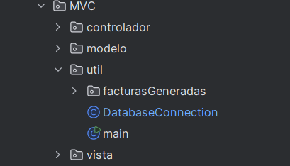

# VETERINARIA JB

## Descripción del Proyecto
Este proyecto tiene como objetivo desarrollar un sistema eficiente para la gestión de una clínica veterinaria, permitiendo optimizar el manejo de información y la administración de sus operaciones.

## Funcionamiento del Sistema
El sistema está diseñado para gestionar la información de las mascotas, sus dueños, historial de salud, inventario de medicamentos y vacunas, agenda de consultas y procedimientos médicos, así como la facturación y servicios adicionales.

### Módulo de Login
En este módulo se encuentra la vista y la lógica para el acceso a la plataforma. Si el usuario no está registrado en el sistema, deberá completar el proceso de registro.

### Módulo de Registro (SignUp)
El usuario ingresa la información requerida para crear una cuenta en el sistema. Sus datos serán almacenados en la base de datos para permitir su acceso a la plataforma.

### Módulo de Administrador
En esta interfaz, el Administrador tiene acceso a diversas opciones de gestión:
1. Gestión de Mascotas
2. Gestión de Personas
3. Gestión de Consultas Médicas
4. Gestión de Historial Médico
5. Gestión de Vacunas
6. Gestión de Inventario
7. Gestión de Facturación

### Módulo de Veterinario
En esta interfaz, el Veterinario tiene acceso a las siguientes funcionalidades:
1. Revisión de Mascotas
2. Gestión de Consultas Médicas
3. Aplicación y registro de Vacunas
4. Revisión del Historial Médico
5. Revisión de Procedimientos Médicos

### Módulo de Clientes
En esta interfaz, los clientes tienen acceso a:
1. Consulta de Tipos de Procedimientos
2. Visualización y descarga de Facturas en formato PDF

## Tecnologías Utilizadas
 

## Estructura de Archivos

## Desarrolladores
Este proyecto ha sido desarrollado por **Brayan Maldonado** y **Jaime Barrera** como parte del filtro de Java para *Campuslands*.

